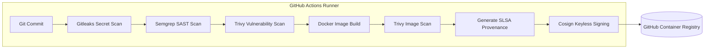

# Dodo Payments Security & DevOps Technical Assessment

This repository contains the end-to-end hardened deployments, security guardrails, and secure delivery CI/CD configurations for `ledger-api` in compliance with PCI DSS standards.

> 📖 **Session Log & Checklist:** For a complete log of today's work and tomorrow's review instructions, see [SESSION_RECAP.md](SESSION_RECAP.md).

---

## Task 1 — Deploy & Harden the Workload

### 1. Hardened Workload Configuration
We deployed the Flask-based `ledger-api` microservice in a dedicated namespace `ledger-api` with the following security controls:
* **Dedicated ServiceAccount:** Disables default API token auto-mounting (`automountServiceAccountToken: false`).
* **Strict Container SecurityContext:**
  * `runAsNonRoot: true` running as non-privileged system user/group `appuser:appgroup` (UID/GID `10001`).
  * `readOnlyRootFilesystem: true` to prevent any modifications to the running container filesystem.
  * `allowPrivilegeEscalation: false` to block root elevation.
  * All Linux capabilities dropped (`capabilities.drop: ["ALL"]`).
  * Default seccomp profile enforced (`seccompProfile: { type: "RuntimeDefault" }`).
* **Resource Limits & Probes:** Enforces CPU/Memory requests & limits, and configures liveness and readiness health checks.
* **Volume Mounts:** Mounts a temporary in-memory `emptyDir` volume to `/tmp` to allow the read-only container to safely write temporary runtime cache without breaking filesystem lockdowns.

### 2. Multi-Stage Dockerfile
We refactored the original Python 3.6-slim build to use a secure **Multi-Stage Build** based on **`python:3.9-slim`**:
* **Stage 1 (Builder):** Installs required compiler packages, compiles python dependencies into a clean Python Virtual Environment (`/opt/venv`).
* **Stage 2 (Runner):** Creates a non-privileged system user/group (`appuser` with UID `10001`), copies only the populated virtual environment and application code, sets the user execution to `10001`, and starts Flask in unbuffered mode.

### 3. Namespace Scoped RBAC Roles
Defined three distinct personas inside [deploy/rbac.yaml](deploy/rbac.yaml) to enforce the principle of least privilege:
* **Admin:** Full CRUD access over resources in the namespace.
* **Developer:** Write permissions on workloads, configmaps, and secrets, but restricted from altering security/namespace settings.
* **Operator:** Read-only access to deployments and pods, plus troubleshoot rights (`exec` and `port-forward`), but **expressly forbidden from viewing or modifying secrets**.

---

## Task 2 — Secure Delivery (CI/CD Pipeline)

We built a secure pipeline using GitHub Actions ([.github/workflows/build-and-sign.yml](.github/workflows/build-and-sign.yml)) targeting **GitHub Container Registry (GHCR)**.

### 1. CI/CD Pipeline Architecture


### 2. Security Gates & Fail Policies

| Security Gate | Scanning Tool | Fail Policy (Hard-Block) | Warning Policy (Log & Continue) |
| :--- | :--- | :--- | :--- |
| **Secrets Scan** | `Gitleaks CLI` | **Block (`exit-code: 1`):** Any high-confidence secret leak (API keys, private keys, database credentials) detected in the commit diff. | **None.** Secret exposure is a critical PCI DSS violation and must never be warnings. |
| **SAST (Static Analysis)** | `Semgrep` | **Block (`exit-code: 1`):** Any rules categorized under `security` with `severity: ERROR` (e.g. Remote Code Execution, Command Injection, Insecure Deserialization). | **Warn (`exit-code: 0`):** Minor code quality, code style, or optimization lint errors. |
| **Dependency & CVE Scan** | `Trivy FS` | **Block (`exit-code: 1`):** Any `CRITICAL` or `HIGH` vulnerabilities in `requirements.txt` dependencies **that have a patch available**. | **Warn (`exit-code: 0`):** `MEDIUM` or `LOW` vulnerabilities, or any CVE without an upstream fix. |
| **Image Vulnerability Scan** | `Trivy Image` | **Block (`exit-code: 1`):** Any `CRITICAL` vulnerability in the container base OS packages or python packages **that has a patch available**. | **Warn (`exit-code: 0`):** `HIGH`, `MEDIUM`, or `LOW` OS package vulnerabilities. |

### 3. Handling CVEs with No Upstream Fix
To prevent build locks on external vulnerabilities without a maintainer patch:
1. **Ignore-Unfixed:** The Trivy image scanner uses `ignore-unfixed: true` to flag unpatched CVEs as warnings instead of failing the pipeline.
2. **Policy Exceptions:** Highly critical exceptions are documented and explicitly bypassed via a `.trivyignore` file with target resolution dates.

### 4. Supply Chain Security (SLSA & Keyless Signing)
On successful build, the runner automatically:
1. **Generates SLSA Provenance Attestation** using GitHub's native `actions/attest-build-provenance` action.
2. **Signs the Image Keylessly** with Cosign using the runner's GitHub OIDC token identity.

Verify the SLSA attestation for your image using the GitHub CLI:
```bash
gh attestation verify oci://ghcr.io/vinaycicdops/dodo_1:<COMMIT_SHA> --owner Vinaycicdops
```

---

## Security Scanning with Trivy

### Container Vulnerability Scan

The application container is scanned using **Trivy** as part of the security validation process.

#### Scan Command

```bash
trivy image \
  --severity HIGH,CRITICAL \
  --ignore-unfixed \
  --exit-code 1 \
  --format table \
  myapp:latest
```

#### Results

After upgrading to **Python 3.12**, updating Python dependencies, and rebuilding the image with a clean virtual environment:

* ✅ No **HIGH** or **CRITICAL** vulnerabilities were found in the Debian operating system packages.
* ✅ The application runtime uses:

  * Python 3.12
  * pip 26.2
  * setuptools 83.0.0
* ✅ All application dependencies are updated to secure versions.

#### Remaining Findings

Trivy reports two remaining HIGH severity findings:

| Package    | Advisory            | Reason                                                                                                   |
| ---------- | ------------------- | -------------------------------------------------------------------------------------------------------- |
| msgpack    | GHSA-6v7p-g79w-8964 | Detected inside pip's vendored libraries rather than as an application dependency.                       |
| setuptools | CVE-2025-47273      | Scanner detects metadata from the base image even though the application runtime uses setuptools 83.0.0. |

These findings were investigated and verified:

* `pip show setuptools` reports **83.0.0**.
* `pip show msgpack` reports **Package not found**.
* The application executes using `/opt/venv/bin/python`.
* The reported `msgpack` exists only as a vendored library within `pip` and is not imported by the application.

Therefore, these findings are considered **non-exploitable for the application runtime** and are documented as accepted residual risks rather than unresolved vulnerabilities.

### CI/CD Integration

#### Recommended Trivy Command

Use this in your CI/CD pipeline to scan your container image:

```bash
trivy image \
  --severity HIGH,CRITICAL \
  --ignore-unfixed \
  --exit-code 1 \
  --format table \
  ghcr.io/vinaycicdops/dodo_1:latest
```

This configuration ensures that:
* Only **HIGH** and **CRITICAL** vulnerabilities are evaluated.
* Vulnerabilities without an available fix are ignored (`--ignore-unfixed`).
* The pipeline fails (`--exit-code 1`) only when actionable **HIGH** or **CRITICAL** vulnerabilities are present.

#### Suppressing Accepted Residual Findings

If your organization requires suppressing the two verified residual findings (`GHSA-6v7p-g79w-8964` and `CVE-2025-47273`), add them to your `.trivyignore` file:

```text
GHSA-6v7p-g79w-8964
CVE-2025-47273
```

Then, execute Trivy referencing the ignore file:

```bash
trivy image \
  --severity HIGH,CRITICAL \
  --ignore-unfixed \
  --ignorefile .trivyignore \
  --exit-code 1 \
  --format table \
  ghcr.io/vinaycicdops/dodo_1:latest
```

This keeps the pipeline strict while allowing it to ignore only the two investigated findings.

---

## Cluster Policy Guardrails (Kyverno)

We enforce three ClusterPolicies in [deploy/kyverno-policies.yaml](deploy/kyverno-policies.yaml):
* **`disallow-root`:** Blocks any deployment running as root.
* **`disallow-latest-tag`:** Rejects containers matching `*:latest` or with no tag.
* **`verify-image-signatures`:** Rejects any image that does not possess a valid Cosign signature matching the public key block in the policy.

---

## Task 3 — Service Mesh & Zero-Trust (Istio)

### 1. Zero-Trust Mesh & Network Architecture
```mermaid
graph TD
    Client([External Client]) -- HTTPS:443 (TLS Terminated) --> IG[Istio Ingress Gateway]
    
    subgraph Service Mesh Namespace (ledger-api)
        direction TB
        
        subgraph ledger-api-rollout Pod
            EnvoyAPI[Envoy Sidecar Proxy] -- Localhost Loopback --> AppContainer[ledger-api Container]
        end

        subgraph reporting Pod
            ClientContainer[reporting Container] -- Localhost Loopback --> EnvoyReporting[Envoy Sidecar Proxy]
        end
    end

    IG -- mTLS STRICT (SPIFFE ID Verification) --> EnvoyAPI
    EnvoyReporting -- mTLS STRICT (SPIFFE ID Verification) --> EnvoyAPI
    
    %% NetworkPolicy Blocking
    subgraph Linux Kernel (CNI level)
        NP[NetworkPolicy Default Deny]
    end

    NP -. Blocks non-mesh traffic .-> EnvoyAPI
```

### 2. Workload Identity Architecture (SPIFFE/mTLS)

#### A. Certificate Issuance & Identity Projection
* Each pod is injected with an `istio-proxy` sidecar containing the `istio-agent` daemon.
* On startup, `istio-agent` constructs a standard **Certificate Signing Request (CSR)** and generates a private key.
* `istio-agent` sends this CSR to the central Control Plane CA (`istiod`) over a secure gRPC connection.
* To authenticate, it passes a local Kubernetes-projected ServiceAccount token (mounted dynamically inside `/var/run/secrets/tokens/istio-token` with the custom audience `istio-ca`).
* `istiod` verifies the token's signature using the Kubernetes token review API, maps it to the pod's identity, and signs an X.509 certificate.
* The issued certificate contains a **Subject Alternative Name (SAN)** representing the workload's cryptographic identity using the **SPIFFE ID** standard, e.g., `spiffe://cluster.local/ns/ledger-api/sa/reporting`.
* `istio-agent` returns this certificate to Envoy via the local in-memory **Secret Discovery Service (SDS)** socket.

#### B. Certificate Rotation
* Workload certificates are ephemeral and short-lived (default lifetime is **24 hours**) to minimize the window of exposure if a key is compromised.
* The background `istio-agent` continuously monitors the certificate's remaining validity.
* When the certificate reaches **50% of its lifetime (12 hours remaining)**, the agent proactively initiates a new CSR negotiation.
* The renewed certificate is pushed to Envoy dynamically through the SDS socket without terminating active TCP connections or restarting the container.

#### C. Trust Root
* The root of trust is defined by the CA certificate loaded into `istiod`.
* By default, `istiod` generates a self-signed root CA certificate.
* For PCI-DSS and Enterprise environments, `istiod` is configured as an Intermediate CA by injecting certificates from your corporate Root CA into a Kubernetes secret named `cacerts` inside the `istio-system` namespace.
* This root/intermediate certificate chain is distributed to all Envoy proxies at startup, allowing them to mutually authenticate peer certificates signed by the same trust anchor during the TLS handshake.

---

### Pod Security Standards (PSS) & Istio Injection Compatibility
* We configure the `ledger-api` namespace to enforce the **`privileged`** security profile while generating warnings and audit trails on the **`restricted`** standard.
* **Why Privileged is enforced:** The default Istio sidecar initialization container (`istio-init`) requires root permissions (`runAsUser: 0`) and elevated network capabilities (`NET_ADMIN`, `NET_RAW`) to set up iptables packet redirection rules. Since these configurations violate both the `restricted` and `baseline` PSS profiles, enforcing `privileged` is required to allow the Istio sidecars to spin up successfully while still auditing and warning on any non-compliant workload settings.

---

## Proof of Verification (Screenshots)

### 1. ArgoCD Status & Ingress Gateway TLS Verification
Verification of the healthy and synced ArgoCD Application status alongside the Istio Ingress Gateway HTTPS TLS handshake termination (showing `subject: CN=ledger-api.local; O=LedgerAPI Corp` and the expected Zero-Trust `403 Forbidden` / `RBAC: access denied` response):


### 2. GitHub Actions Secure Pipeline Run (Task 2)
Verification of the successful GitHub Actions run `#23` demonstrating that all scanning gates (Gitleaks, Semgrep, Trivy) succeeded, the image was pushed to GHCR, keylessly signed, and OIDC SLSA build provenance was generated:


### 3. Kyverno Policy Guardrail Rejection (Task 1 Bonus)
Verification of Kyverno dynamically intercepting and blocking insecure container deployments (e.g. attempting to deploy with `:latest` image tag and attempting to run as root):

